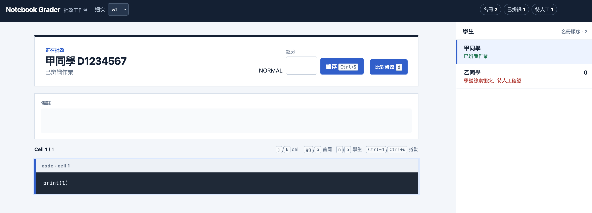

# Notebook Grader

Local viewer for saved Jupyter notebook outputs and weekly grades. Runtime uses only the Python standard library; notebooks are displayed, never executed.



## Run

Install [uv](https://docs.astral.sh/uv/), then run from this repository:

```bash
uv run --locked nbgrader --course-root /path/to/course
```

The course directory must contain `homework/<week>/` (at least one week) and `docs/26_pattern-recognition_students-list.csv` with columns `姓名` and `學號`. For another roster filename, pass `--roster docs/other-roster.csv` (a path inside the course directory). The viewer opens at `http://127.0.0.1:8000`; open that address yourself if no browser opens automatically. Stop the server with Ctrl+C.

See [course data layout](homework/README.md) for a directory tree and CSV format.

## Review and grading

Choose a week, then select a student or expand the file list on the right. Only `.ipynb` files can be previewed. The roster order is retained; file names are sorted in the file list. Notebooks under a week are discovered recursively.

Automatic assignment requires exactly one roster ID (`D` followed by seven digits) in the file path **relative to that week** and no *different* roster ID in its contents. Names and IDs found only in contents are hints, not assignments; another student's name does not invalidate an otherwise unique path ID. Multiple path IDs, a different roster ID in the contents, or multiple assigned notebooks for one student require manual review. Notebooks without a roster ID can still be inspected from the file list. A file ending in `_title.ipynb` is a reference, never a student submission.

An identified student starts with a blank score; a student with no uniquely reviewable notebook, or one that cannot be parsed, starts at `0`. Previously saved scores take precedence. To handle a conflict, inspect the files in the file list, then select the student in the roster to enter a score and note manually; file preview itself cannot save a grade or establish an assignment. To restore automatic assignment, correct the files or paths in the course directory and reload the page.

Enter a score from `0` to `100` (decimals accepted) and press **儲存**. Saving writes `submission/<week>/scores.csv` with `姓名,學號,成績,備註` rows for the entire roster; the default `0` is only displayed until a score is saved. To compare code with the reference, select a student with an assigned notebook and press **比對修改**. Comparison requires exactly one top-level `*_title.ipynb` in that week's directory; without it, or with several, comparison reports an error. Neither preview nor comparison executes notebook code.

## Check

```bash
uv run --locked nbgrader --course-root /path/to/course --self-test
uv run --locked python -m unittest discover -s tests -v
```

Keep student rosters, notebooks, and grades in the course repository or another appropriately protected data location, not in this repository.
